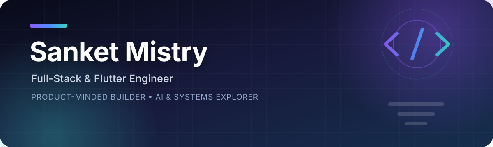

  

   

  
  
  
  
   
  

## About me

I'm a **full-stack and Flutter engineer** who enjoys turning real business workflows into reliable, polished products. I work across mobile interfaces, backend APIs, data models, authentication, real-time systems, and AI-assisted decision tools - with a strong bias toward shipping end-to-end.

- Building an offline-friendly **Flutter fintech app at Subcidys**, with Riverpod, GoRouter, secure API integration, and reusable design systems.
- Developing multi-tenant business products with **React, Node.js, Express, PostgreSQL, and Prisma**.
- Exploring **systems engineering and ML inference** through Linux networking, socket programming, GPU fundamentals, model serving, and performance profiling.
- Pursuing a **B.Tech in Computer and Communication Technology at LNMIIT** (2023-2027).
- Open to software engineering internships and collaborative product work.

## Selected work

<table>
  <tr>
    <td width="50%" valign="top">
      <h3>AssetFlow</h3>
      
Multi-tenant enterprise asset and resource management with five-level RBAC, department scoping, bookings, transfers, maintenance, audits, and secure REST APIs.

      
<code>React</code> <code>Node.js</code> <code>PostgreSQL</code> <code>Prisma</code>

      <a href="https://github.com/Sanketmis208/assetflow-haas">Repository</a> · <a href="https://asset-flow.ink/">Live demo</a>
    </td>
    <td width="50%" valign="top">
      <h3>Insurance Claim Decision Assistant</h3>
      
LLM-powered claim evaluation combining structured parameter extraction, retrieval-augmented policy context, and explainable rule-based decisions.

      
<code>FastAPI</code> <code>LLM</code> <code>ChromaDB</code> <code>React</code>

      <a href="https://github.com/Sanketmis208/Insurance-Claim-Decision-Assistant">Repository</a>
    </td>
  </tr>
  <tr>
    <td width="50%" valign="top">
      <h3>CodeCollab</h3>
      
Real-time collaborative IDE with Monaco Editor, synchronized rooms, file sharing, chat, a shared whiteboard, and WebRTC video calls.

      
<code>React</code> <code>Socket.IO</code> <code>MongoDB</code> <code>WebRTC</code>

      <a href="https://github.com/Sanketmis208/CodeCollab">Repository</a>
    </td>
    <td width="50%" valign="top">
      <h3>DhatuScan</h3>
      
Cross-platform Ayurvedic health assessment app with Google OAuth, profile workflows, algorithmic imbalance scoring, and personalized recommendations.

      
<code>Flutter</code> <code>Express</code> <code>PostgreSQL</code> <code>Prisma</code>

      <a href="https://github.com/Sanketmis208/DhatuScan_App">Repository</a>
    </td>
  </tr>
  <tr>
    <td width="50%" valign="top">
      <h3>Florinaa</h3>
      
Conversion-focused product website and protected admin dashboard with content management, lead capture, CSV exports, and hardened authentication.

      
<code>JavaScript</code> <code>Node.js</code> <code>JWT</code> <code>Responsive UI</code>

      <a href="https://github.com/Sanketmis208/Florinaa">Repository</a> · <a href="https://www.florinaa.com/">Live site</a>
    </td>
    <td width="50%" valign="top">
      <h3>TransitOps</h3>
      
Flutter operations client connected to an existing fleet-management API, with cross-platform delivery, authenticated workflows, and backend integration.

      
<code>Flutter</code> <code>Dart</code> <code>REST API</code> <code>PostgreSQL</code>

      <a href="https://github.com/Sanketmis208/TransiOps_app">Repository</a>
    </td>
  </tr>
</table>

<a href="https://github.com/Sanketmis208?tab=repositories"><strong>Explore all repositories →</strong></a>

## Toolbox

  

| Area | Technologies and practices |
|---|---|
| **Mobile** | Flutter, Dart, Riverpod, Provider, GoRouter, responsive and offline-friendly UI |
| **Frontend** | React, Next.js, Vite, TypeScript, JavaScript, Tailwind CSS |
| **Backend** | Node.js, Express, FastAPI, REST APIs, WebSockets, Socket.IO, JWT, OAuth 2.0 |
| **Data & AI** | PostgreSQL, MongoDB, MySQL, Prisma, LangChain, ChromaDB, Pandas, NumPy, scikit-learn |
| **Engineering** | Git, Docker, GCP, Vercel, CI/CD fundamentals, system design, RBAC, multi-tenancy |

## A few numbers

| 200+ | 80+ | 5 | 1739 |
|:---:|:---:|:---:|:---:|
| LeetCode problems solved | Students mentored as a TA | RBAC roles implemented in AssetFlow | Peak LeetCode contest rating |

## GitHub activity

  
  

  

## Highlights

- Mentored **80+ undergraduate students** as a Teaching Assistant for scripting, NumPy, Pandas, and scikit-learn.
- Solved **200+ data structures and algorithms problems** with a peak LeetCode contest rating of **1739**.
- Ranked in the **top 3.8% of 1.1M+ candidates** in JEE Main (96.2 percentile).
- Comfortable owning a product from UI and API design through data modeling, security, testing, and deployment.

## Let's build something useful

I'm especially interested in **mobile engineering, backend systems, developer tools, fintech, applied AI, and performance-minded software**.

  <a href="mailto:sanketmistry.codes@gmail.com"><strong>Email me</strong></a>
  &nbsp;·&nbsp;
  <a href="https://www.linkedin.com/in/sanket-mistry-666164287/"><strong>LinkedIn</strong></a>
  &nbsp;·&nbsp;
  <a href="https://www.sanketmistry.space/"><strong>Portfolio</strong></a>

<em>Build clearly. Ship responsibly. Keep learning.</em>

